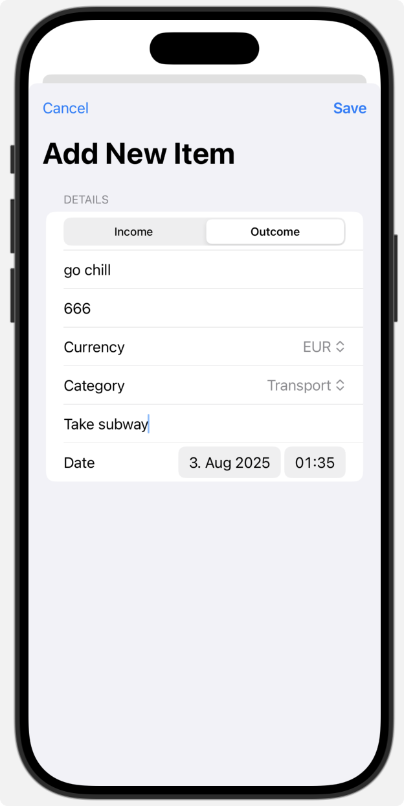
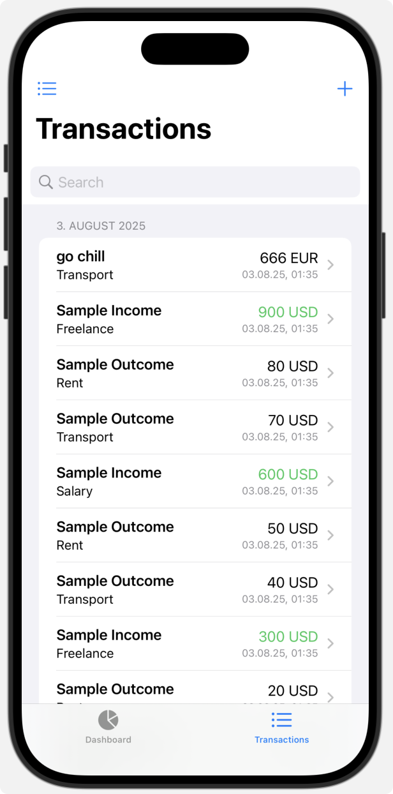
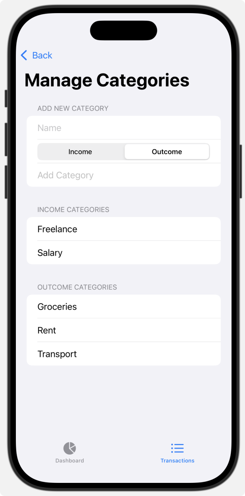
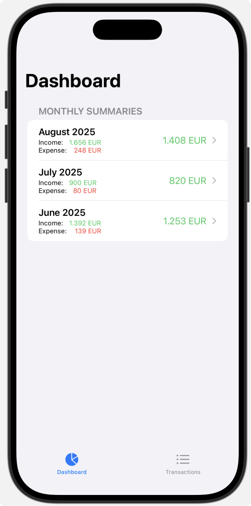
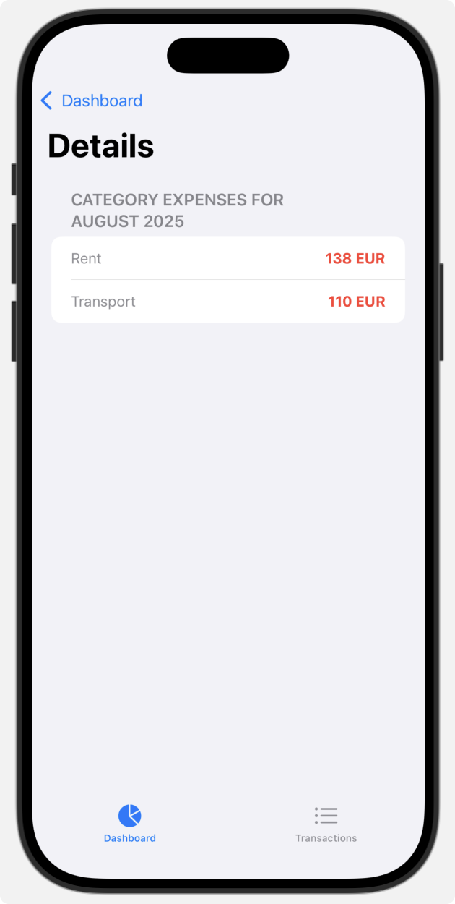

# In-out

A simple iOS and macOS app for tracking items with titles, amounts, and timestamps.

## Features

*   Add/delete items (title, amount with verification, and timestamp)
*   View/delete items in a list showing the title and timestamp
*   View the details of each item showing the title, amount, and timestamp
*   Search transactions by title, category, amount, currency, and notes.
*   Improved detail view layout for transactions.
*   Dashboard with monthly netto summaries (income, expenses, and balance).
*   Detailed view of category expenses for each month.
*   Automatic currency conversion to local currency for all summaries (using hardcoded, user-modifiable rates).
*   Summary numbers displayed as integers.

## Screenshots

| Add Item | Transaction History | Manage Categories | Dashboard Monthly Summary | Monthly Detail |
|:---:|:---:|:---:|:---:|:---:|
|  |  |  |  |  |

## Demo Video

## Roadmap

*   **Photo Attachment:** Add functionality to attach one or more photos (e.g., invoices, item receipts) to transaction items.
*   **iCloud Sync:** Integrate iCloud synchronization for seamless data access across devices.
*   **Recurring Transactions:** Add support for recurring transactions to automate regular entries, such as monthly bills or subscriptions.
*   **Export/Import:** Implement features to export and import transaction data.
*   
